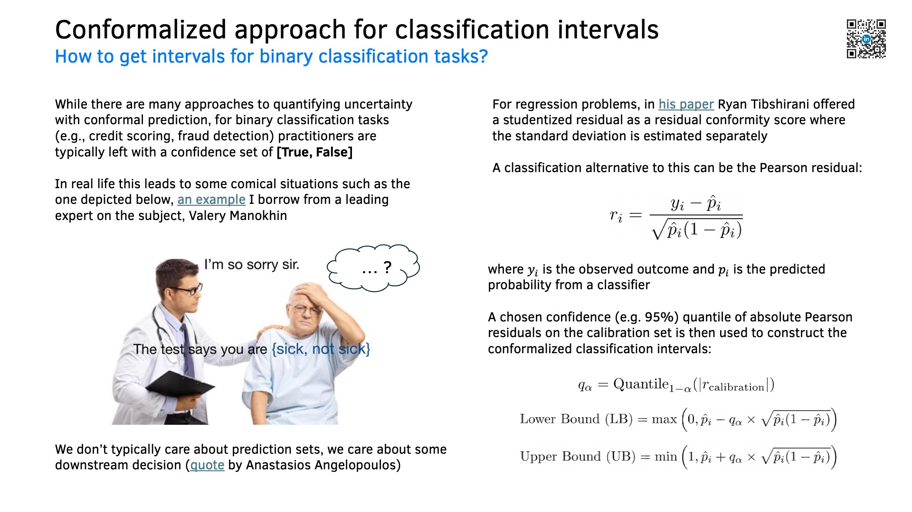
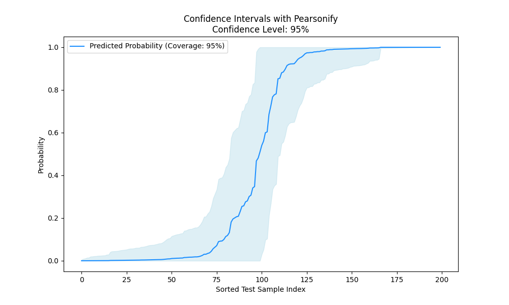

# 💡 Pearsonify
## Probabilistic Classification with Conformalized Intervals

**Pearsonify** is a lightweight 🐍 Python package for generating **classification intervals** around predicted probabilities in binary classification tasks.

It uses **Pearson residuals** and **principles of conformal prediction** to quantify uncertainty without making strong distributional assumptions.



### 🚀 Why Pearsonify?

* 📊 **Intuitive Classification Intervals**: Get reliable intervals for binary classification predictions.
* 🧠 **Statistically Grounded**: Uses Pearson residuals, a well-established metric from classical statistics.
* ⚡ **Model-Agnostic**: Works with any model that provides probability estimates.
* 🛠️ **Lightweight**: Minimal dependencies, easy to integrate into existing projects.

### 📦 How to install?

Use `pip` to install the package from GitHub:

```bash
pip install git+https://github.com/xRiskLab/pearsonify.git
```

### 💻 How to use?

```python
import numpy as np
from pearsonify import Pearsonify
from sklearn.svm import SVC
from sklearn.datasets import make_classification
from sklearn.model_selection import train_test_split

# Generate synthetic classification data
np.random.seed(42)
X, y = make_classification(
    n_samples=1000, n_features=20, n_informative=10, n_classes=2, random_state=42
)

# Split data into train, calibration, and test sets
X_train, X_temp, y_train, y_temp = train_test_split(X, y, test_size=0.4, random_state=42)
X_cal, X_test, y_cal, y_test = train_test_split(X_temp, y_temp, test_size=0.5, random_state=42)

# Initialize Pearsonify with an SVC model
clf = SVC(probability=True, random_state=42)
model = Pearsonify(estimator=clf, alpha=0.05)

# Fit the model on training and calibration sets
model.fit(X_train, y_train, X_cal, y_cal)

# Generate prediction intervals for test set
y_test_pred_proba, lower_bounds, upper_bounds = model.predict_intervals(X_test)

# Calculate coverage
coverage = model.evaluate_coverage(y_test, lower_bounds, upper_bounds)
print(f"Coverage: {coverage:.2%}")

# Plot the intervals
model.plot_intervals(y_test_pred_proba, lower_bounds, upper_bounds)
```

Running `example.py` will generate the following plot:



This plot shows predicted probabilities with 95% confidence intervals, sorted by prediction score.

### 📖 References

Hosmer, D. W., Lemeshow, S., & Sturdivant, R. X. (2013). Applied Logistic Regression. John Wiley & Sons.

Tibshirani, R. (2023). Conformal Prediction. Advanced Topics in Statistical Learning, Spring 2023.

### 📝 License

This project is licensed under the MIT License - see the [LICENSE](LICENSE) file for details.